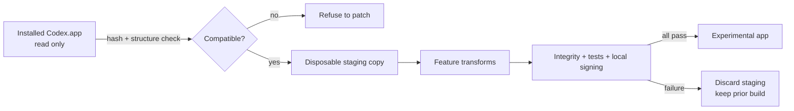

[English](README.md) · [简体中文](README.zh-CN.md)

# Codex Pet Runtime Toolkit

> **Developer Preview / Experimental** — validated only with the listed Codex Desktop builds on **macOS arm64**.

Enhance Codex desktop pets with physical pointer gaze, persistent semantic animations, and inactivity sleep—while keeping the primary Codex.app untouched.

## What it adds

| Capability | Behaviour |
| --- | --- |
| Physical Pointer Gaze | Feeds physical cursor coordinates into Codex's existing V2 16-direction selector: 360°, 22.5° sectors, visual-centre origin, radius and boundary hysteresis. Gaze wins over hover by default; `--codex-pet-gaze-hover-jumps` restores hover jumping. |
| Persistent Semantic States | Loops only `running` and `review` while Codex keeps those semantic states active. All other animations retain their bounded behaviour. |
| Inactivity / Sleep | Optionally layers a separate looping sleep strip over strict idle. Passive hover, gaze, pointer movement, and window focus neither reset inactivity nor wake; pet pointer-down, drag, and meaningful semantic work wake immediately. |

The toolkit connects signals Codex already owns rather than replacing its semantic state machine or V2 atlas contract. See [design decisions](docs/design-decisions/runtime-capabilities.md).

## Safety first

**The default workflow never patches the primary Codex.app.** It verifies the official installed app, creates a disposable staging copy, patches and validates that copy, ad-hoc signs it locally, then promotes it only after every gate passes.



No Codex application, executable, vendor bundle, user profile, or patched build is distributed here. Users build an experimental copy from their own installation. Read the [safety model](docs/architecture/safety-model.md) before trying it.

## Developer-preview quick start

Prerequisites: the validated Codex build, macOS arm64, Node.js 20+, and a clean checkout.

```sh
npm run check
npm run build:production
./scripts/launch.sh
```

The output is limited to `local/apps/`. Production sleep is 180 seconds; `npm run build:qa` uses the documented 8-second fixture setting. Configuration changes require rebuilding/relaunching the disposable copy. Full steps: [installation](docs/developer-preview/installation.md), [configuration](docs/configuration.md), and [rollback](docs/developer-preview/rollback.md).

## Compatibility and failure behaviour

The compatibility manifest checks platform, architecture, version, build, full app material hashes, target-entry hashes, and counted structural fingerprints. A mismatch aborts before copying or patching. Updates require a new reviewed manifest; there is no best-guess mode.

| Validated target | Status |
| --- | --- |
| Codex 26.908.40834 / build 8881 / macOS arm64 | Supported developer preview |
| Codex 26.915.31945 / build 9922 / macOS arm64 | Supported developer preview |
| Codex 26.917.62051 / build 10789 / macOS arm64 | Supported developer preview; automated and live Phase 1–3 validation complete |
| Any other version, build, platform, or architecture | Unsupported; fail closed |

Details: [compatibility](docs/compatibility.md).

## Public test fixture

`fixtures/generic-v2-debug-pet/` is deterministic geometric art generated from repository code. It exercises the 8×11 V2 atlas, 16 gaze sectors, standard state rows, durable and bounded plans, and a separate optional eight-frame sleep strip. It contains no private character material.

## Verify and revert

Run `npm run check` before every build or release review. Previous experimental copies are retained under ignored `local/rollback/`; restore one with `node src/cli/rollback.mjs <rollback-app-path>`. Deleting `local/` removes toolkit-created apps, profiles, reports, and rollbacks without touching the installed source app.

## Known limitation: mixed-display dragging

Fast/long drag glitches also reproduced with a built-in pet in unmodified Codex. In one instrumented pass, 13/13 native handoffs returned `started=true`; the clearest failure was downstream of handoff. On the tested setup, the built-in display appeared stable while the issue occurred on an extended large display, making mixed scale/coordinate handling a stronger hypothesis—not a universal conclusion. No workaround is included. See [known limitations](docs/troubleshooting/known-limitations.md).

## Project status

This is source for technical review, not a one-click installer, universal-compatibility release, notarized distribution, or production-ready product. Broader compatibility, packaging, and optional interactions remain future work.

The toolkit's original code and documentation are licensed under [Apache-2.0](LICENSE). That license does not grant rights over Codex/OpenAI software or third-party pet assets; users remain responsible for artwork and assets they install. See [licensing](docs/legal/licensing.md).

Contributions should begin with [CONTRIBUTING.md](CONTRIBUTING.md). Security-sensitive reports belong in [SECURITY.md](SECURITY.md).
