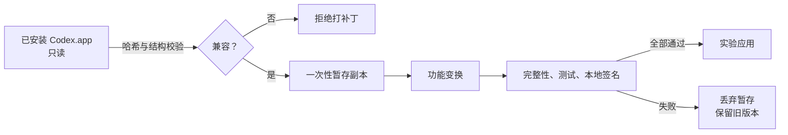

[English](README.md) · [简体中文](README.zh-CN.md)

# Codex 桌宠互动扩展

> **让 Codex 桌宠更灵动。**

> **开发者预览 / 实验性项目** — 目前仅验证下表所列的 Codex Desktop 版本，平台为 **macOS arm64**。

鼠标移动时，桌宠会看向不同方向；Codex 工作、思考或等待查阅结果时，对应动画可以持续播放；长时间闲置时，桌宠会自然进入睡眠。整个过程不修改主 Codex.app。

## 已实现能力

| 能力 | 行为 |
| --- | --- |
| 物理指针注视 | 将物理鼠标坐标接入 Codex 已有的 V2 十六方向选择器：360°、每区 22.5°、以宠物视觉中心为原点，并带激活半径及滞回。默认注视优先；启动参数 `--codex-pet-gaze-hover-jumps` 可恢复悬停跳跃优先。 |
| 持续语义状态 | 仅当 Codex 的语义状态仍为 `running` 或 `review` 时循环对应完整动画；其他状态继续保持有限时长。 |
| 闲置 / 睡眠 | 可选地在“严格空闲”上叠加独立睡眠动画。被动移动、悬停、注视及窗口聚焦不会重置计时或唤醒；直接按下宠物、拖动或新的语义工作会立即唤醒。 |

本扩展复用 Codex 已有的状态与 V2 图集契约，而不另造语义状态机。详见[设计决策](docs/design-decisions/runtime-capabilities.md)。

## 安全模型

**默认流程绝不修改主 Codex.app。** 工具先验证已安装应用，再创建一次性暂存副本；只有补丁、完整性验证、测试和本地临时签名全部通过，副本才会被提升为实验应用。



仓库不分发 Codex 应用、可执行文件、厂商 bundle、用户资料或补丁后的应用。用户必须从自己安装的 Codex 创建实验副本。使用前请阅读[安全模型](docs/architecture/safety-model.md)。

## 开发者预览用法

需要：已验证的 Codex 版本、macOS arm64、Node.js 22.12+ 与 pnpm 11。项目将 `@electron/asar` 固定为构建期依赖，用于确定性处理 ASAR 头部哈希与 Electron 41+ 的嵌入式完整性摘要。

```sh
pnpm install --frozen-lockfile
npm run check
npm run build:production
./scripts/launch.sh
```

输出被限制在 `local/apps/`。生产睡眠阈值为 180 秒；`npm run build:qa` 使用 8 秒测试设置。配置变更后需要重新构建并重启实验副本。参见[安装](docs/developer-preview/installation.md)、[配置](docs/configuration.md)和[回滚](docs/developer-preview/rollback.md)。

## 兼容性

清单会校验平台、架构、版本、build、整包哈希、目标文件哈希及计数后的结构指纹。任何不匹配都会在复制或修改前终止。当前兼容清单覆盖 `26.908.40834 / 8881`、`26.915.31945 / 9922`、`26.917.62051 / 10789` 与 `26.924.20706 / 11431`；11431 已完成自动验证与私有环境下 20/20 实时行为验收。其他版本、build、平台或架构均不受支持，并会安全拒绝运行。Codex 更新后通常需要新的兼容清单，工具不会猜测性打补丁。

通用测试宠物由脚本生成，仅含几何图形，可验证 8×11 V2 图集、16 个注视方向、标准状态、持续/有限动画及独立睡眠条；不含私人角色素材。

## 已知限制

快速或长距离拖动故障也能在未修改 Codex 的内置宠物上复现。一次采样中 13/13 次原生交接均为 `started=true`，最明确的失败发生在交接之后。测试机器的内置屏幕看似稳定，而扩展大屏会出现问题，因此混合屏幕缩放/坐标空间是更强的当前假设，但并非普遍结论。本扩展未加入规避补丁。详见[已知限制](docs/troubleshooting/known-limitations.md)。

本项目是 source-available（源码可查看）的技术评审用开发者预览，不是单击安装器、通用兼容正式发布或经公证的商用品，也不是 OSI 定义的开源项目。

当前版本的原创代码与文档采用 [Codex Pet Interaction Enhancer Personal Use License 1.0](LICENSE)。个人非商业使用、安装和私下本地修改均被允许；禁止商业使用、再分发、重新打包及公开发布修改版本。本项目不分发或许可 Codex/OpenAI 软件；第三方桌宠素材与未来角色向项目可能采用单独条款，用户须自行确保有权使用其安装的美术与素材。详见[许可证说明](docs/legal/licensing.md)。
