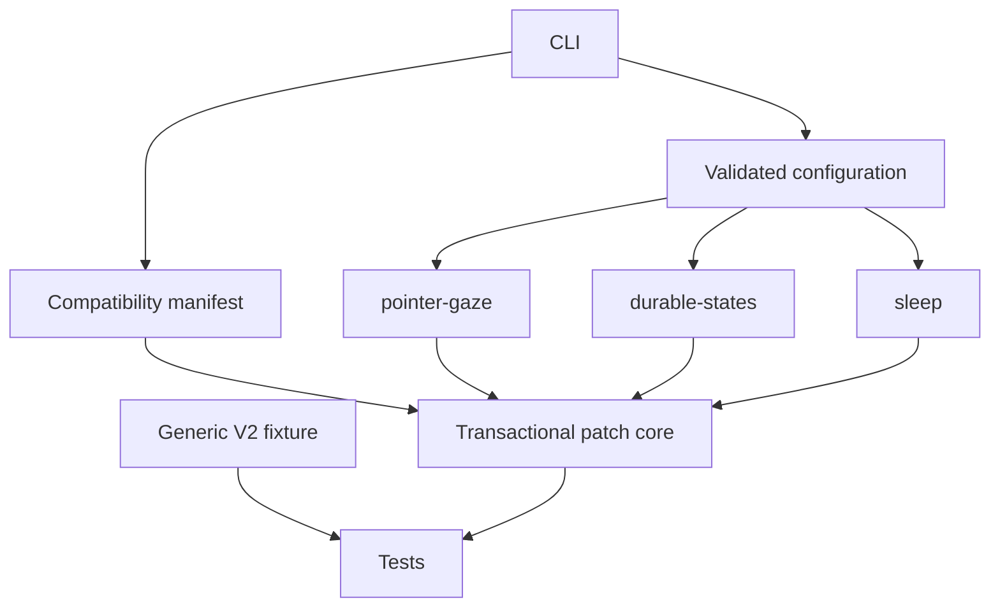

# Architecture

`src/model/` is deterministic reference logic used by public tests. `src/features/` contains narrow transforms for a hash-verified Codex bundle. `src/patch-core/` owns ASAR rewriting, staging, integrity, signing, promotion, and rollback. `src/compatibility/` refuses unsupported inputs. Pet-specific capability data and optional assets stay outside runtime code.

Transforms are deliberately version-pinned. Each supported build has its own manifest and, where syntax differs, feature-local transform profile. Filenames, minified structural anchors, and exact entry hashes remain update-sensitive. Whole-entry hashes plus counted anchors make failure safe, not update-proof.
